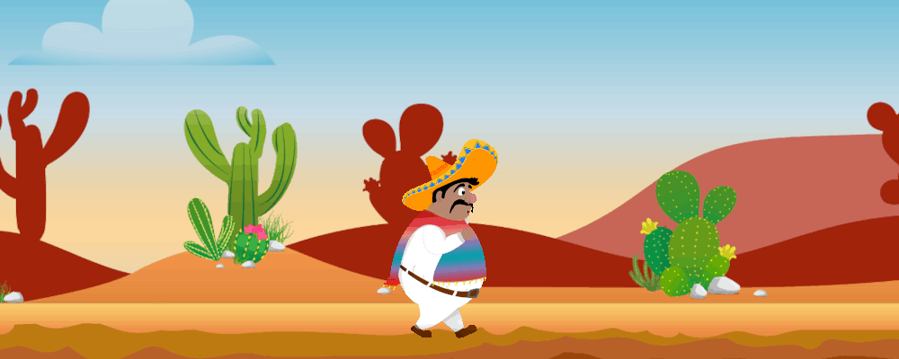

#### 🎮 My Game Changer - Pepe El Peligroso:

## 💫 About Me:
Welcome! 🙌  🩷 Front-end Dev  Trainee 🧪 Background in Biochemistry 📌 Currently learning Angular & TypeScript 🔎 I have a keen eye for details 💡 Funfact: Three seconds and I’m asleep.

### 🌐 Socials:
  

## 💻 Tech Stack:
            
## 📊 GitHub Stats:
 
 

#### 🔝 Top Contributed Repo

---

<!-- Created with GPRM ( https://gprm.itsvg.in ) -->