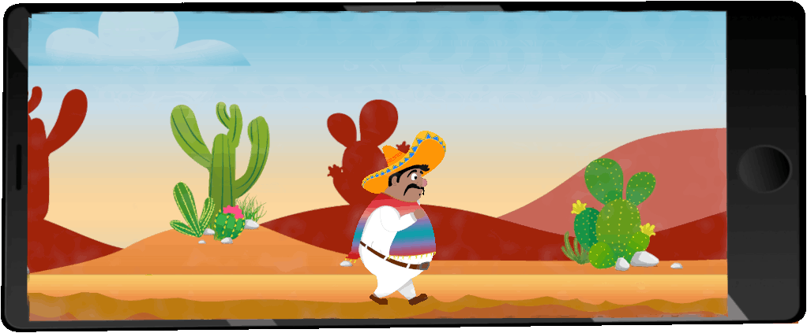
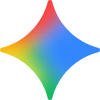
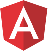
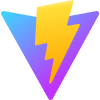
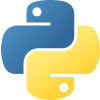
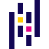
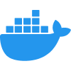
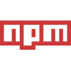
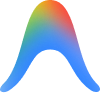
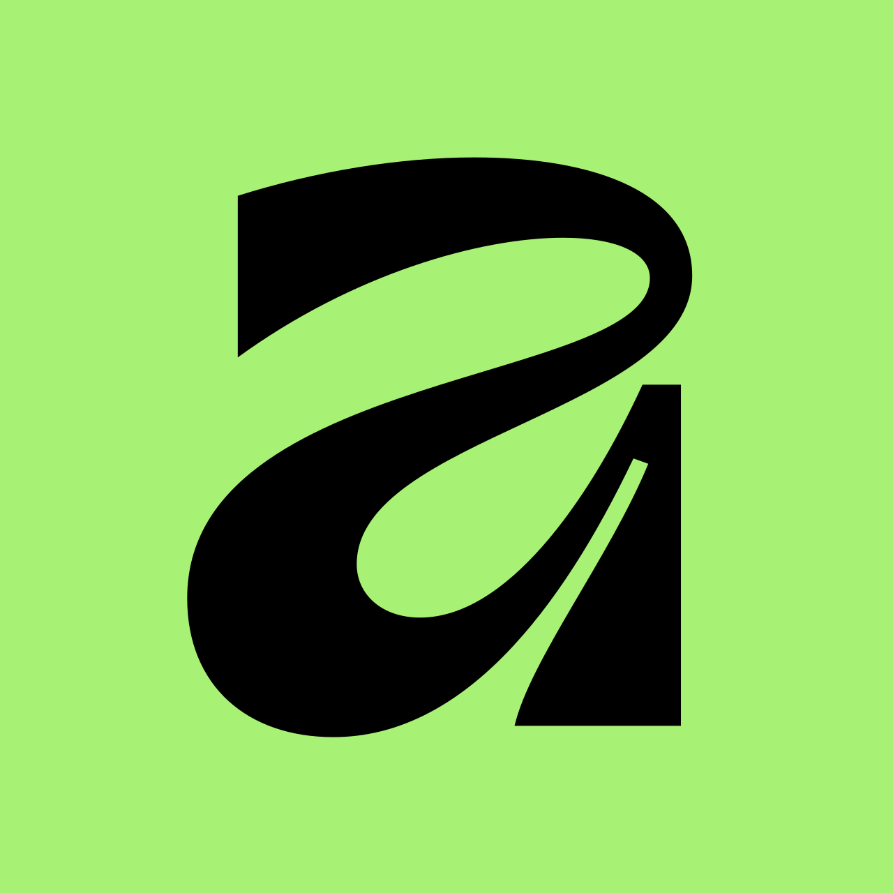

#### My Game Changer - Pepe El Peligroso:

## About Me:

Welcome! 🙌  
🧠 Data & AI Engineer 
🩷 Fullstack Developer 
🧪 Background in Biochemistry 
☁️ Currently learning Azure & Microsoft Foundry 
🎮 Exploring Three.js & 3D modeling 
🔎 I have a keen eye for details 
💡 Funfact: Three seconds and I'm asleep.

### 🌐 Socials:

 

## GitHub Stats:

---

## 🚀 Currently Learning:

---

#### 🤖 AI Models – Planning, Assistant & Testing:

---

## 🧩 Frontend:

---

## 🛠️ Backend & Data:

---

## 🔧 Dev Tools & Workflow:

---

## 🎨 Creative Design Tools:

---

More information

#### 🔝 Top Contributed Repo

---

<!-- Created with GPRM ( https://gprm.itsvg.in ) -->

