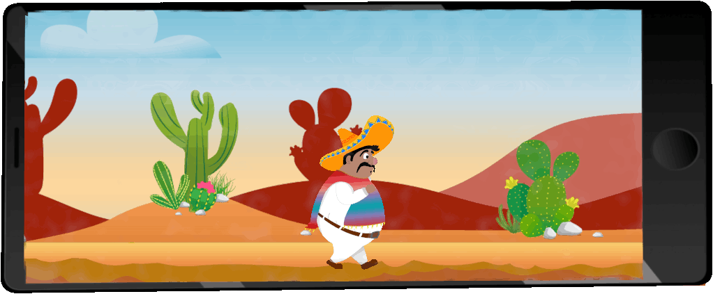

#### My Game Changer - Pepe El Peligroso:

## About Me:

Welcome! 🙌  🩷 Front-end Developer 🧪 Background in Biochemistry 📌 Currently learning Django 🔠I have a keen eye for details 💡 Funfact: Three seconds and I’m asleep.

### 🌐 Socials:
 

 ## GitHub Stats:

 

## Currently Learning:

   

## Tech Stack:

                  

### Creative Design Tools:

 

 
 
 
 

 

More information

#### 🔝 Top Contributed Repo

---

<!-- Created with GPRM ( https://gprm.itsvg.in ) -->

